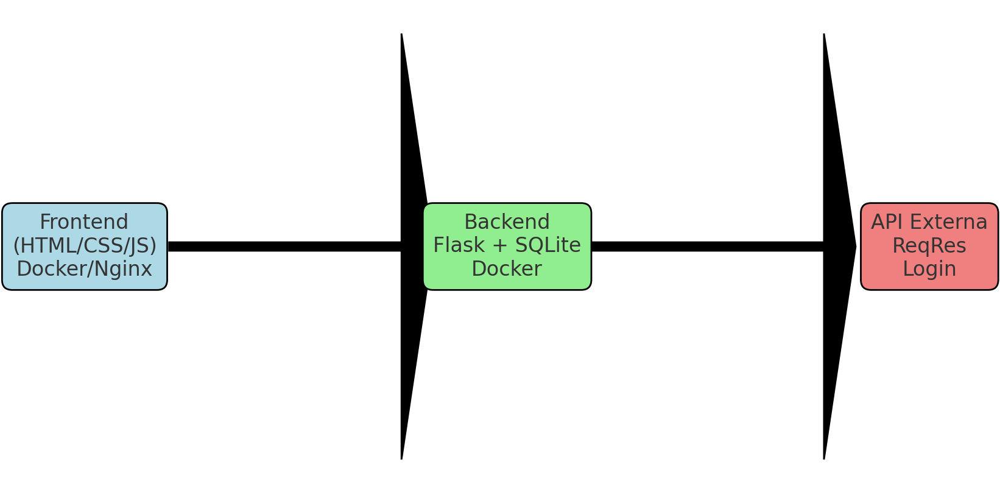

# naFila - Backend

API principal do sistema **naFila**. Implementada em Flask + SQLite.

## Funcionalidades
- CRUD de conteúdos (GET, POST, PUT, DELETE)
- Filtros por tipo e status
- Autenticação integrada com API externa [ReqRes](https://reqres.in/)

## Rotas
- `POST /auth/login` → autenticação (API externa)
- `GET /contents` → listar conteúdos (com filtros opcionais)
- `POST /contents` → criar novo conteúdo
- `PUT /contents/<id>` → atualizar conteúdo
- `DELETE /contents/<id>` → remover conteúdo

## Como rodar com Docker
```bash
docker build -t nafila-backend .
docker run -p 5000:5000 nafila-backend
```

## Arquitetura

