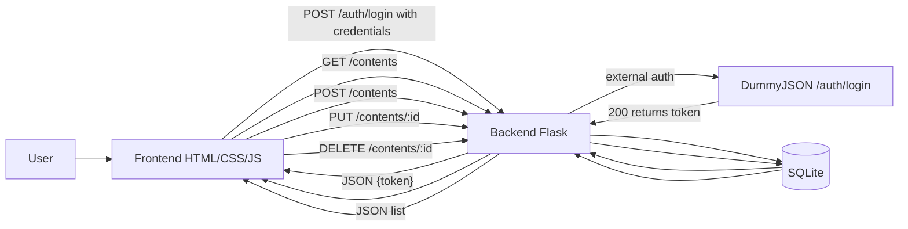

# naFilaPlus — Backend (Flask)

---

## 🔧 Pré‑requisitos
- Docker

---

## 🚀 Build
```bash
docker rm -f nafila-backend 2>/dev/null || true
docker build -t nafila-backend .
```

## ▶️ Execução (modo padrão: DummyJSON)
Credenciais públicas e estáveis do provedor:
- **username:** `emilys`
- **password:** `emilyspass`

```bash
docker run -d --name nafila-backend -p 5000:5000 nafila-backend
```

Teste rápido:
```bash
curl -s http://127.0.0.1:5000/health
curl -s -X POST http://127.0.0.1:5000/auth/login \  -H 'Content-Type: application/json' \  -d '{"email":"emilys","password":"emilyspass"}'
# -> 200 OK + {"message":"Login bem-sucedido","token":"..."}
```

---

## 📚 Endpoints
- `GET /health` → `{"status":"ok"}`
- `POST /auth/login` → autentica no provedor externo (DummyJSON)
- `GET /contents` → lista conteúdos
- `POST /contents` → cria conteúdo
- `PUT /contents/:id` → atualiza
- `DELETE /contents/:id` → remove

---

## 📈 Fluxograma (Mermaid)


---
